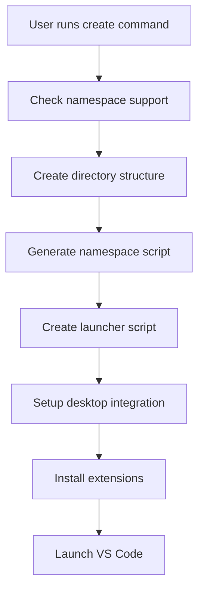
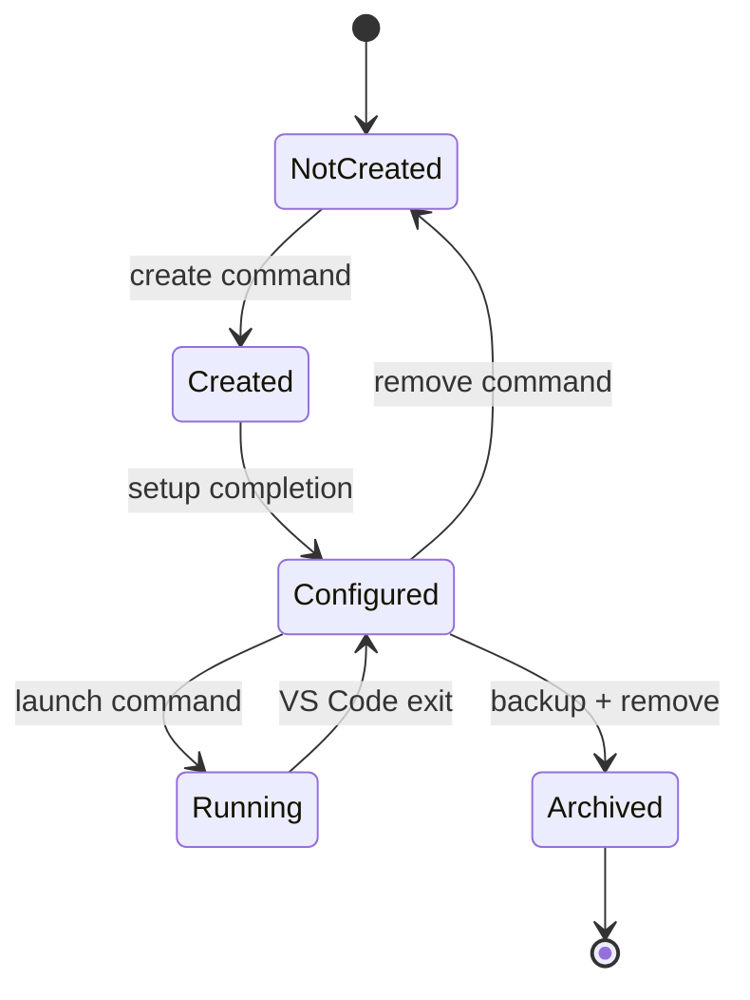

# VS Code Sandbox Architecture

This document provides a detailed technical overview of the VS Code Sandbox architecture and isolation mechanisms.

## 🏗️ High-Level Architecture

```
┌─────────────────────────────────────────────────────────────┐
│                    Host System                              │
│  ┌─────────────────────────────────────────────────────────┐│
│  │              Isolated Profile Container                 ││
│  │  ┌─────────────────────────────────────────────────────┐││
│  │  │                VS Code Instance                     │││
│  │  │  • Isolated filesystem view                        │││
│  │  │  • Separate PID namespace                          │││
│  │  │  • Private /tmp, /var/tmp                          │││
│  │  │  • Isolated XDG directories                        │││
│  │  │  • Custom environment variables                    │││
│  │  └─────────────────────────────────────────────────────┘││
│  │  Profile-specific resources:                           ││
│  │  • ~/.config/Code → /isolated/profiles/NAME/.config    ││
│  │  • ~/.cache → /isolated/profiles/NAME/.cache           ││
│  │  • ~/.local → /isolated/profiles/NAME/.local           ││
│  │  • /tmp → /isolated/profiles/NAME/tmp                  ││
│  └─────────────────────────────────────────────────────────┘│
│                                                             │
└─────────────────────────────────────────────────────────────┘
```

## 🔒 Isolation Mechanisms

### 1. Linux Namespaces

VS Code Sandbox uses multiple Linux namespace types for comprehensive isolation:

#### Mount Namespaces (`--mount`)
- Creates separate filesystem views for each profile
- Bind mounts isolated directories over standard locations
- Provides read-only access to system directories when needed
- Prevents filesystem pollution between profiles

#### PID Namespaces (`--pid --fork --mount-proc`)
- Each profile gets its own process tree
- Processes cannot see or interact with other profile processes
- Isolated `/proc` filesystem
- Enhanced security and process separation

#### UTS Namespaces (`--uts`)
- Separate hostname and domain name space
- Prevents hostname conflicts
- Additional isolation layer

#### IPC Namespaces (`--ipc`)
- Isolated inter-process communication
- Separate shared memory segments
- Independent message queues and semaphores
- Prevents IPC-based interference

### 2. Filesystem Isolation

```
~/.vscode-isolated/
├── profiles/
│   └── <profile-name>/
│       ├── home/                    # Isolated $HOME
│       │   ├── .config/
│       │   │   ├── Code/           # VS Code settings
│       │   │   ├── fontconfig/     # Font configuration
│       │   │   └── gtk-3.0/        # GTK settings
│       │   ├── .cache/
│       │   │   ├── Code/           # VS Code cache
│       │   │   └── fontconfig/     # Font cache
│       │   ├── .local/
│       │   │   ├── share/
│       │   │   │   ├── Code/       # Extensions & data
│       │   │   │   ├── applications/ # Desktop entries
│       │   │   │   ├── mime/       # MIME types
│       │   │   │   ├── fonts/      # Custom fonts
│       │   │   │   └── themes/     # Custom themes
│       │   │   └── bin/            # Local binaries
│       │   └── .profile            # Environment setup
│       ├── tmp/                     # Isolated temp directory
│       └── projects/                # Project files
├── launchers/
│   ├── <profile>-launcher.sh       # Profile launcher
│   └── <profile>-namespace.sh      # Namespace setup script
└── backups/                         # Profile backups
```

### 3. Environment Isolation

Each profile gets completely isolated environment variables:

```bash
export HOME="$PROFILE_HOME"
export XDG_CONFIG_HOME="$PROFILE_HOME/.config"
export XDG_CACHE_HOME="$PROFILE_HOME/.cache"
export XDG_DATA_HOME="$PROFILE_HOME/.local/share"
export XDG_STATE_HOME="$PROFILE_HOME/.local/state"
export XDG_RUNTIME_DIR="$PROFILE_TMP/runtime"
export TMPDIR="$PROFILE_TMP"
export TMP="$PROFILE_TMP"
export TEMP="$PROFILE_TMP"
```

## 🚀 Launch Process

### 1. Profile Creation Flow



### 2. Launch Sequence

1. **Launcher Script Execution**
   - Parses command-line arguments
   - Validates profile existence
   - Prepares namespace environment

2. **Namespace Creation**
   - Creates isolated namespaces using `unshare`
   - Sets up filesystem bind mounts
   - Configures environment variables

3. **VS Code Execution**
   - Launches VS Code with isolated parameters
   - Uses custom user-data and extensions directories
   - Applies profile-specific configurations

### 3. Namespace Script Flow

```bash
# Create namespace with multiple isolation types
unshare \
    --mount \      # Filesystem isolation
    --uts \        # Hostname isolation  
    --ipc \        # IPC isolation
    --pid \        # Process isolation
    --fork \       # Fork for PID namespace
    --mount-proc \ # Mount isolated /proc
    "$NAMESPACE_SCRIPT" "$@"
```

## 🔧 Component Details

### 1. Main Script (`vscode-isolate.sh`)

**Core Functions:**
- `create_profile()`: Complete profile setup
- `launch_profile()`: Profile execution
- `remove_profile()`: Clean removal
- `list_profiles()`: Profile enumeration
- `show_status()`: Profile information

**Key Features:**
- Auto-detection of VS Code binary
- Comprehensive error handling
- Namespace support validation
- Desktop integration setup

### 2. Profile Manager (`vscode-profile-manager.sh`)

**Advanced Operations:**
- Interactive profile selection
- Profile comparison and analysis
- Backup and restore functionality
- Profile cloning capabilities

### 3. Test Suite (`vscode-isolation-test.sh`)

**Validation Tests:**
- Filesystem isolation verification
- Process separation testing
- Environment variable isolation
- Desktop integration validation
- Multiple profile independence
- Clean removal verification

## 🛡️ Security Model

### 1. Isolation Boundaries

```
Host System
├── System Files (read-only access)
├── User Home (completely isolated)
├── Temp Directories (isolated per profile)
├── Process Space (isolated per profile)
└── IPC Mechanisms (isolated per profile)
```

### 2. Access Controls

- **Read-Only System Access**: Profiles can read system files but cannot modify them
- **Isolated User Space**: Each profile has its own user directory tree
- **Process Isolation**: Profiles cannot see or interact with other profile processes
- **Network Isolation**: Optional network namespace isolation (can be added)

### 3. Data Protection

- **No Cross-Profile Contamination**: Profiles cannot access each other's data
- **Host System Protection**: Profiles cannot modify host VS Code installations
- **Clean Removal**: Complete profile removal without traces
- **Backup Security**: Encrypted backup options available

## 🔄 State Management

### 1. Profile States

- **Not Created**: Profile directory doesn't exist
- **Created**: Directory structure exists
- **Configured**: Launcher and desktop integration ready
- **Running**: VS Code instance active
- **Archived**: Profile backed up and removed

### 2. State Transitions



## 📊 Performance Considerations

### 1. Resource Usage

- **Memory**: Each profile uses standard VS Code memory plus isolation overhead (~50MB)
- **Disk**: Profile directories typically 100-500MB depending on extensions
- **CPU**: Minimal overhead from namespace creation (~1-2% during launch)

### 2. Optimization Strategies

- **Lazy Loading**: Extensions loaded only when needed
- **Shared System Resources**: Read-only bind mounts for system files
- **Efficient Cleanup**: Automatic cleanup of temporary files
- **Compression**: Backup files use gzip compression

## 🔮 Future Enhancements

### 1. Planned Features

- **Network Isolation**: Optional network namespace isolation
- **Resource Limits**: CPU and memory limits per profile
- **Encrypted Profiles**: Profile encryption at rest
- **Remote Profiles**: Support for remote profile storage

### 2. Advanced Isolation

- **SELinux Integration**: Enhanced security with SELinux policies
- **AppArmor Support**: Additional confinement with AppArmor
- **Container Integration**: Optional Docker/Podman backend
- **GPU Isolation**: Isolated GPU access for specific profiles

This architecture provides a robust foundation for complete VS Code isolation while maintaining performance and usability.
